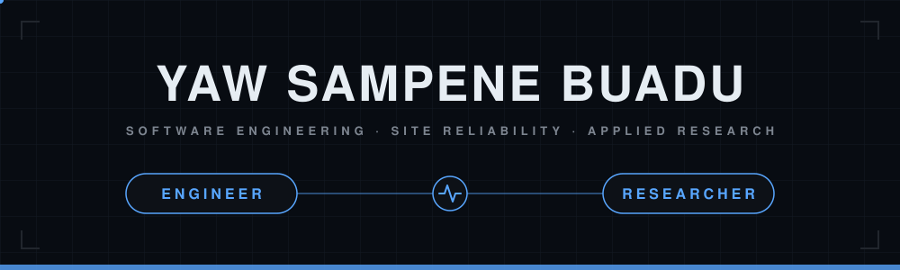
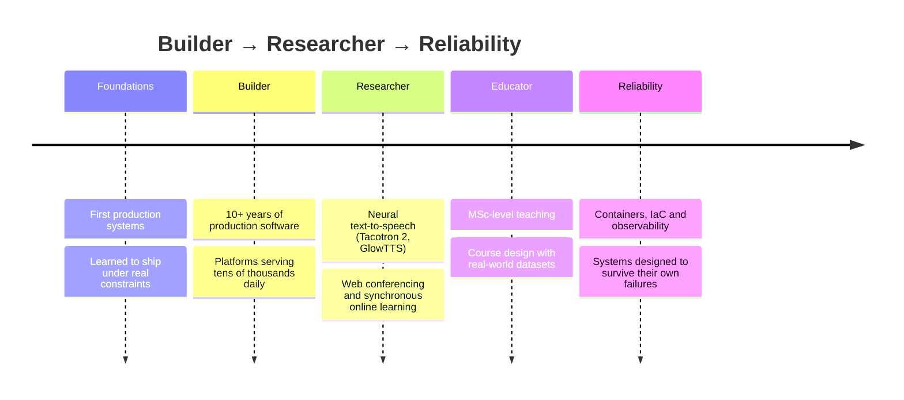

<div align="center">




</div>

## ⚡ The short version

> ### I build systems that serve real people — and keep them running.

- 🔧 **10+ years** shipping production software — platforms serving **tens of thousands of daily users**
- ☸️ I run containerised workloads, define infrastructure as code, and instrument everything I ship
- 📡 **IT, Media & Communications lead** for an international organisation — infrastructure across **43 countries**
- 🏫 I teach at **MSc level** — Python for precision agriculture, mobile apps, networking and web interfaces
- 🔬 Applied research in **synchronous online learning**, plus neural text-to-speech and RAG-based AI assistants

## 🛰️ How I run things

```console
$ systemctl status yaw.service

● yaw.service — Software Engineer · Site Reliability
     Loaded: loaded (/etc/systemd/system/yaw.service; enabled)
     Active: active (running) since 2015; 10+ years
   Main PID: 1 (shipping)
     Status: "Production systems across 43 countries"
     Domains: edtech · fintech · media · saas
     CGroup: /system.slice/yaw.service
             ├─ containers      docker · kubernetes
             ├─ infra-as-code   terraform · declarative environments
             ├─ delivery        ci/cd pipelines · ship on green, roll back fast
             ├─ observability   prometheus · grafana · alerting that means something
             └─ practice        slos · incident response · blameless postmortems
```

## 🗺️ How I got here



## 🛠️ Arsenal

<div align="center">

**Ship with**


**Run on**


**Watch with**


</div>

**Domains:** EdTech · Fintech (payments & biometrics) · Media platforms · Mobile · Web · SaaS

## 📐 By the numbers

<div align="center">

| **10+** | **43** | **10k+** | **24/7** |
|:---:|:---:|:---:|:---:|
| years shipping | countries served | daily active users | production ownership |

</div>

## 🔬 Research & teaching

- Peer-reviewed publication and conference presentations in Malta, Spain and the UK on web conferencing
- Doctoral research on synchronous online learning — the technical *and* social side of why sessions fail
- Course designer and instructor: Python for precision agriculture, including Jupyter notebooks built on live weather-API data
- Building **WebCon Companion**, a RAG-based AI knowledge assistant for synchronous online learning
- Regularly invited to speak on technology, AI and career navigation — most recently a 60-minute talk to 100+ attendees

## 📫 Get in touch

Systems & Software Engineering, Site reliability, DevOps, EdTech consulting and research collaboration.

<div align="center">

[](mailto:yawsambuadu@gmail.com)
[](https://www.linkedin.com/in/yawsampenebuadu/)

</div>

---

<div align="center">

*Building systems that serve real people — and keeping them up.*

</div>
